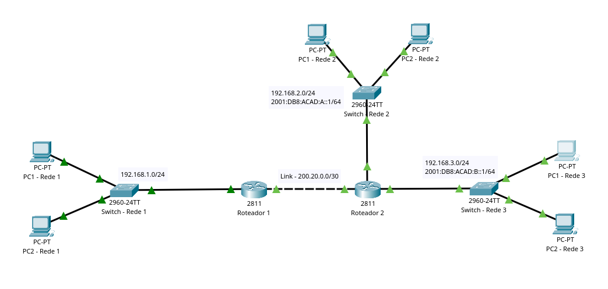

<h1 align='center'>Trabalho 2 - Redes 2023.2</h1>

## Conteudos

- [Dependências](#dependencias)
- [Configurações Utilizadas](#configs)
- [Topologia da Rede](#topologia)
- [Integrantes](#integrantes)

## Dependências 

Para poder visualizar de forma completa o trabalho é necessário:

- Cisco Packet Tracer - V8.2.1.0118 (https://skillsforall.com/resources/lab-downloads?courseLang=en-US)

## Configurações Utilizadas 

## Topologia da Rede 

A topologia da rede se apresenta da seguinte forma:

## Integrantes 

- Alice Pereira Ferreira Pinto

- Gustavo Oliveira Pessanha da Silva
